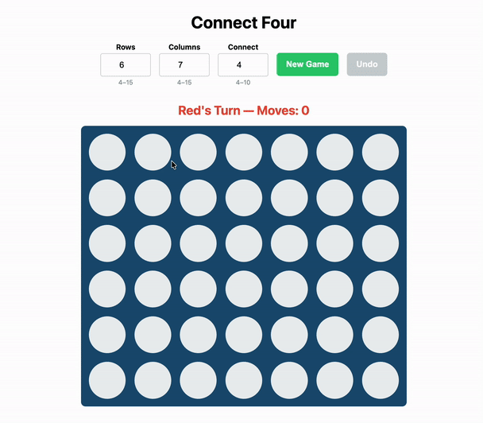

# Connect Four

A Kotlin/JS Connect Four built on Compose HTML — immutable state core, O(k) direction-vector win detection, CSS-animation-driven feedback, zero UI libraries beyond Compose HTML itself.




## Run

```bash
./gradlew jsBrowserRun   # dev server
./gradlew jsTest         # 30 tests, Karma + Chrome Headless
```

Requires JDK 17+.

## Features

- Configurable board (4–15 rows/cols) and Connect N (4–10, N ≤ min(rows, cols)).
- Ghost-piece hover preview, full keyboard play.
- Undo chain stored inline as `GameState.previous: GameState?` — no separate stack.
- `localStorage` persistence with validated rehydrate; `lastMove` survives refresh so the drop animation replays.
- Winning-cell pulse, invalid-move column shake driven by a transient `rejectedColumn: Int?`.
- Color-blind-safe glyphs (`●` RED, `▲` YELLOW), `aria-live` status and move announcer, 44px touch targets, responsive 375px → 1200px+.

### Controls

- **Mouse:** click a column to drop; hover shows a ghost piece in the landing cell.
- `←` / `→` — move the keyboard cursor across columns (works for any board width).
- `Enter` / `Space` — drop in the focused column.
- `1`–`9`, `0` — jump to columns 1–10. On boards wider than 10 columns, use the arrow keys to reach columns 11+.

## Architecture

- **State flow.** `App` owns `mutableStateOf<GameState>`; children receive `state + callbacks`; `Storage.save()` fires only when the board reference changes.
- **Rendering is a pure function of state.** CSS keyframes drive drop / pulse / shake — no JS animation loop, no imperative DOM mutation.
- **Not Compose UI.** Compose HTML is a DOM library — `Div` / `Span` / `Input`, `StyleSheet`, `attrs { }`. No `Modifier`, `Box`, `Column`.

## Design decisions

- **Immutable state, embedded undo.** Every move returns a new `GameState`; undo is `previous ?: this`.
- **Win check from the last move only.** Four direction vectors walked forward/backward — O(k) per move, not a full-board scan.
- **Hardened persistence.** `Storage.load()` enforces explicit ranges and checks board dimensions match config; any failure calls `clear()` and returns `null`.
- **Strict layering.** `game/` has zero Compose imports, so logic tests run without a browser.

## Project structure

```
src/jsMain/kotlin/
├── Main.kt
├── game/          GameState.kt, WinChecker.kt
├── ui/            App.kt, Board.kt, Cell.kt, Controls.kt, StatusBar.kt
├── style/         AppStyles.kt
└── persistence/   Storage.kt
src/jsTest/kotlin/
├── game/          GameStateTest.kt, WinCheckerTest.kt
└── persistence/   StorageTest.kt
```

## Tests (30)

- `GameStateTest` — gravity, stacking, full-column rejection, alternation, undo, post-game-over rejection.
- `WinCheckerTest` — 4 directions, Connect 5/6/10, 15×15 board, impossible-win → DRAW.
- `StorageTest` — round-trip, corrupt JSON → `null` + auto-clear, out-of-range config → `null`, dimension mismatch → `null`.
